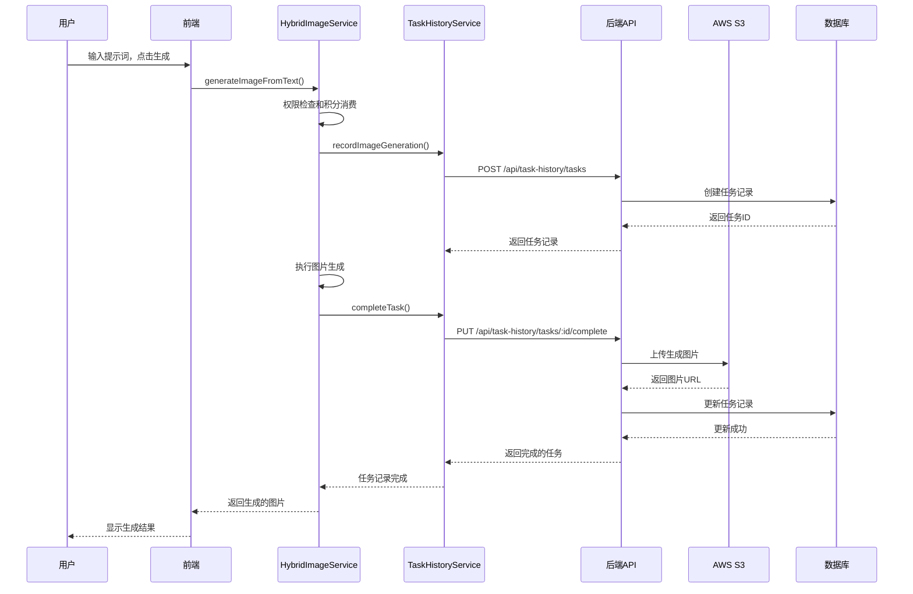
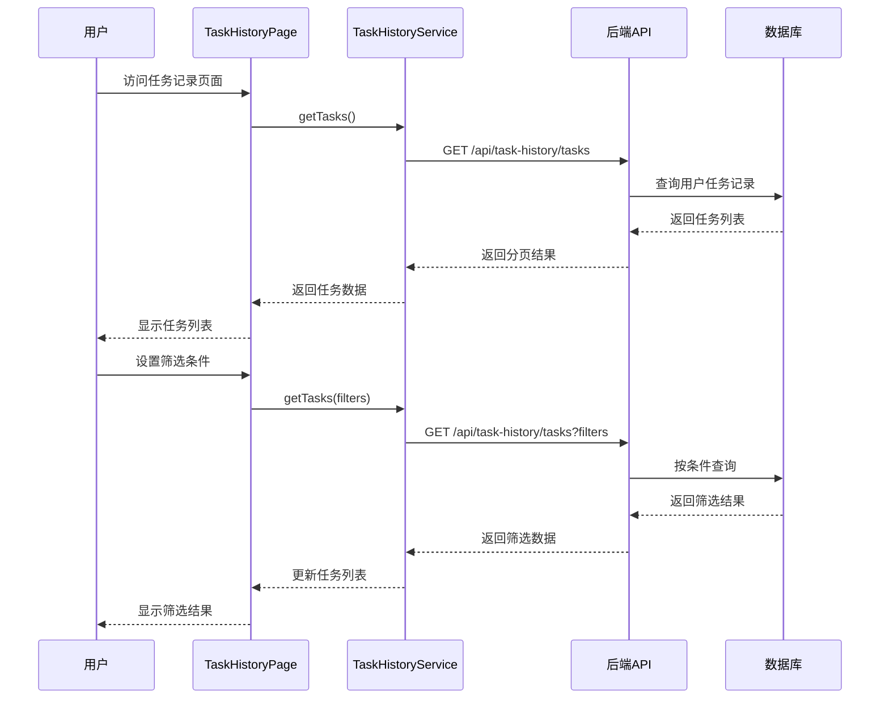

# 用户任务记录系统实现方案

**文档版本**: v1.0  
**创建日期**: 2025-09-18  
**最后更新**: 2025-09-18  

## 📋 系统概述

用户任务记录系统是一个完整的图片生成任务管理解决方案，实现了用户登录后的图片生成记录、统计分析、云存储管理等功能。

### 🎯 核心功能

1. **任务记录管理**
   - 自动记录用户的图片生成任务
   - 保存提示词、原始图片、生成图片
   - 跟踪任务状态和执行时间

2. **云存储集成**
   - 图片自动上传到AWS S3
   - 安全的访问控制和权限管理
   - 高可用性和持久化存储

3. **统计分析**
   - Token消耗统计
   - 积分扣除记录
   - 成功率和平均耗时分析

4. **用户界面**
   - 直观的任务历史浏览
   - 灵活的筛选和分页功能
   - 响应式设计和良好的用户体验

## 🗄️ 数据库设计

### 主要数据表

#### 1. user_task_history (任务记录主表)
```sql
CREATE TABLE user_task_history (
    id UUID PRIMARY KEY DEFAULT gen_random_uuid(),
    user_id UUID NOT NULL REFERENCES auth.users(id) ON DELETE CASCADE,
    task_type VARCHAR(50) NOT NULL DEFAULT 'image_generation',
    prompt TEXT NOT NULL,
    original_image_url TEXT,
    generated_image_url TEXT,
    aws_original_key TEXT,
    aws_generated_key TEXT,
    tokens_used INTEGER DEFAULT 0,
    credits_deducted INTEGER DEFAULT 0,
    status VARCHAR(20) NOT NULL DEFAULT 'pending',
    error_message TEXT,
    aspect_ratio VARCHAR(10),
    model_version VARCHAR(50),
    generation_time_ms INTEGER,
    created_at TIMESTAMP WITH TIME ZONE DEFAULT NOW(),
    updated_at TIMESTAMP WITH TIME ZONE DEFAULT NOW(),
    completed_at TIMESTAMP WITH TIME ZONE
);
```

**字段说明**：
- `task_type`: 任务类型 (image_generation, image_edit, template_generation)
- `prompt`: 用户输入的提示词
- `original_image_url`: 原始图片的公开访问URL
- `generated_image_url`: 生成图片的公开访问URL
- `aws_original_key`: AWS S3中原始图片的存储key
- `aws_generated_key`: AWS S3中生成图片的存储key
- `tokens_used`: 本次任务消耗的token数量
- `credits_deducted`: 本次任务扣除的积分点数
- `status`: 任务状态 (pending, processing, completed, failed)

#### 2. user_task_statistics (统计汇总表)
```sql
CREATE TABLE user_task_statistics (
    id UUID PRIMARY KEY DEFAULT gen_random_uuid(),
    user_id UUID NOT NULL REFERENCES auth.users(id) ON DELETE CASCADE,
    period_type VARCHAR(20) NOT NULL,
    period_date DATE NOT NULL,
    total_tasks INTEGER DEFAULT 0,
    successful_tasks INTEGER DEFAULT 0,
    failed_tasks INTEGER DEFAULT 0,
    total_tokens_used INTEGER DEFAULT 0,
    total_credits_deducted INTEGER DEFAULT 0,
    total_generation_time_ms BIGINT DEFAULT 0,
    avg_generation_time_ms INTEGER DEFAULT 0,
    created_at TIMESTAMP WITH TIME ZONE DEFAULT NOW(),
    updated_at TIMESTAMP WITH TIME ZONE DEFAULT NOW(),
    UNIQUE(user_id, period_type, period_date)
);
```

### 安全策略

- **RLS (Row Level Security)**: 确保用户只能访问自己的数据
- **认证检查**: 所有API都需要有效的JWT token
- **权限验证**: 基于用户订阅计划的功能访问控制

## 🔧 后端API设计

### API路由结构
```
/api/task-history/
├── POST   /tasks                    # 创建任务记录
├── PUT    /tasks/:id/original-image # 上传原始图片
├── PUT    /tasks/:id/complete       # 完成任务记录
├── GET    /tasks                    # 获取任务列表
├── GET    /tasks/:id               # 获取任务详情
├── DELETE /tasks/:id               # 删除任务记录
└── GET    /statistics              # 获取统计信息
```

### 核心API功能

#### 1. 创建任务记录
```javascript
POST /api/task-history/tasks
{
  "task_type": "image_generation",
  "prompt": "用户输入的提示词",
  "aspect_ratio": "1:1",
  "model_version": "gemini-1.5-pro"
}
```

#### 2. 完成任务记录
```javascript
PUT /api/task-history/tasks/:taskId/complete
{
  "generated_image_data": "data:image/jpeg;base64,...",
  "tokens_used": 150,
  "credits_deducted": 1,
  "generation_time_ms": 5000
}
```

#### 3. 获取任务列表
```javascript
GET /api/task-history/tasks?page=1&limit=50&start_date=2025-09-01&end_date=2025-09-18&status=completed
```

### AWS S3集成

#### 存储结构
```
S3存储桶: spotgitagent
├── task-history/
│   └── {user_id}/
│       └── {task_id}/
│           ├── original.{ext}    # 原始图片
│           └── generated.jpg     # 生成图片
```

#### 安全配置
- **访问控制**: 公开读取，服务端写入
- **CORS配置**: 允许前端域名访问
- **生命周期管理**: 可配置自动清理策略

## 🎨 前端实现

### 组件架构

#### 1. TaskHistoryPage (任务记录页面)
**功能特性**：
- 任务列表展示和分页
- 时间范围筛选
- 状态和类型过滤
- 统计信息展示
- 图片预览和灯箱

**主要状态**：
```typescript
interface TaskHistoryState {
  tasks: TaskRecord[];
  statistics: TaskStatistics;
  currentPage: number;
  totalPages: number;
  startDate: string;
  endDate: string;
  statusFilter: string;
  taskTypeFilter: string;
}
```

#### 2. TaskHistoryService (任务记录服务)
**核心方法**：
```typescript
class TaskHistoryService {
  async createTask(taskData): Promise<TaskRecord>
  async uploadOriginalImage(taskId, imageFile): Promise<TaskRecord>
  async completeTask(taskId, completionData): Promise<TaskRecord>
  async getTasks(params): Promise<PaginatedTaskResult>
  async getStatistics(period): Promise<TaskStatistics>
  async recordImageGeneration(prompt, taskType, aspectRatio, originalImageFile)
}
```

#### 3. HybridImageService集成
**任务记录流程**：
```typescript
async generateImageFromText(prompt: string, aspectRatio: string) {
  // 1. 权限检查和积分消费
  const permissionCheck = await this.checkPermissionAndConsumeCredits();
  
  // 2. 创建任务记录
  const taskRecord = await taskHistoryService.recordImageGeneration();
  
  // 3. 执行图片生成
  const imageDataUrl = await this.performGeneration();
  
  // 4. 完成任务记录
  await taskRecord.completeTask({
    imageDataUrl,
    tokensUsed,
    creditsDeducted,
    generationTimeMs
  });
}
```

### 用户界面设计

#### 1. 任务记录入口
- **位置**: 用户菜单 -> 任务记录
- **图标**: 文档图标
- **权限**: 仅登录用户可见

#### 2. 任务列表界面
```
┌─────────────────────────────────────────────────────┐
│ 任务记录                                    [返回]  │
├─────────────────────────────────────────────────────┤
│ 📊 统计信息                                         │
│ ┌─────────┐ ┌─────────┐ ┌─────────┐ ┌─────────┐   │
│ │总任务数 │ │ 成功率  │ │消耗积分│ │平均耗时│   │
│ │   156   │ │  94.2%  │ │  156   │ │  3.2s  │   │
│ └─────────┘ └─────────┘ └─────────┘ └─────────┘   │
├─────────────────────────────────────────────────────┤
│ 🔍 筛选器                                          │
│ [开始日期] [结束日期] [状态] [任务类型]           │
├─────────────────────────────────────────────────────┤
│ 📋 任务列表                                        │
│ ┌─────────────────────────────────────────────────┐ │
│ │ ✅ 图片生成 | 2025-09-18 14:30                │ │
│ │ 提示词: "一只戴着宇航员头盔的小狗..."          │ │
│ │ [原图] [生成图] | 150 tokens | 1 积分 | 3.2s  │ │
│ │                                    [查看][删除] │ │
│ └─────────────────────────────────────────────────┘ │
│ ┌─────────────────────────────────────────────────┐ │
│ │ ❌ 图片编辑 | 2025-09-18 13:45                │ │
│ │ 提示词: "将背景改为夕阳西下的海滩"             │ │
│ │ [原图] [--] | 120 tokens | 1 积分 | 失败      │ │
│ │ 错误: 图片处理超时                             │ │
│ │                                    [查看][删除] │ │
│ └─────────────────────────────────────────────────┘ │
├─────────────────────────────────────────────────────┤
│                              [上一页] 1/10 [下一页] │
└─────────────────────────────────────────────────────┘
```

## 🔄 系统集成流程

### 图片生成任务流程



### 任务查询流程



## 📊 性能优化

### 数据库优化
1. **索引策略**
   ```sql
   CREATE INDEX idx_user_task_history_user_created ON user_task_history(user_id, created_at DESC);
   CREATE INDEX idx_user_task_history_status ON user_task_history(status);
   ```

2. **分页查询优化**
   - 使用LIMIT和OFFSET进行分页
   - 按创建时间倒序排列，提高查询效率

3. **统计数据预计算**
   - 使用触发器自动更新统计表
   - 减少实时计算的性能开销

### 前端优化
1. **图片懒加载**
   - 任务列表中的图片预览使用懒加载
   - 减少初始页面加载时间

2. **虚拟滚动**
   - 大量任务记录时使用虚拟滚动
   - 提高列表渲染性能

3. **缓存策略**
   - 统计数据本地缓存
   - 减少重复API请求

### AWS S3优化
1. **CDN加速**
   - 配置CloudFront CDN
   - 提高图片访问速度

2. **生命周期管理**
   - 设置自动清理策略
   - 控制存储成本

## 🔒 安全考虑

### 数据安全
1. **行级安全 (RLS)**
   ```sql
   CREATE POLICY "Users can view own task history" ON user_task_history
       FOR SELECT USING (auth.uid() = user_id);
   ```

2. **API认证**
   - 所有API都需要有效的JWT token
   - 验证用户身份和权限

3. **数据加密**
   - 敏感数据传输使用HTTPS
   - 数据库连接使用SSL

### 文件安全
1. **上传验证**
   - 文件类型和大小限制
   - 恶意文件检测

2. **访问控制**
   - S3存储桶权限配置
   - 防止未授权访问

## 📈 监控和维护

### 系统监控
1. **性能指标**
   - API响应时间
   - 数据库查询性能
   - 图片上传成功率

2. **错误监控**
   - 任务失败率统计
   - 错误日志收集和分析

3. **资源使用**
   - 数据库存储使用量
   - S3存储成本监控

### 维护任务
1. **数据清理**
   - 定期清理过期任务记录
   - 删除无效的图片文件

2. **性能调优**
   - 定期分析慢查询
   - 优化数据库索引

3. **备份策略**
   - 定期备份任务数据
   - 灾难恢复计划

## 🚀 部署指南

### 环境要求
- Node.js 18+
- PostgreSQL (Supabase)
- AWS S3存储桶
- Nginx反向代理

### 部署步骤

1. **数据库迁移**
   ```bash
   # 在Supabase控制台执行
   psql -f database/create_task_history_tables.sql
   ```

2. **环境变量配置**
   ```bash
   # .env文件
   AWS_ACCESS_KEY_ID=your_access_key
   AWS_SECRET_ACCESS_KEY=your_secret_key
   AWS_REGION=us-east-1
   S3_BUCKET_NAME=spotgitagent
   SUPABASE_URL=your_supabase_url
   SUPABASE_SERVICE_ROLE_KEY=your_service_key
   ```

3. **服务部署**
   ```bash
   # 使用部署脚本
   ./deploy_task_history_system.sh
   ```

4. **验证部署**
   - 检查API健康状态
   - 测试用户登录和任务记录功能
   - 验证图片上传和显示

## 📝 使用说明

### 用户操作流程

1. **访问任务记录**
   - 登录系统
   - 点击用户菜单 -> 任务记录

2. **查看任务历史**
   - 浏览任务列表
   - 使用筛选器查找特定任务
   - 查看任务详情和统计信息

3. **管理任务记录**
   - 查看原始图片和生成图片
   - 删除不需要的任务记录
   - 导出任务数据（未来功能）

### 管理员功能

1. **系统监控**
   - 查看整体使用统计
   - 监控系统性能指标
   - 分析用户行为数据

2. **数据管理**
   - 批量清理过期数据
   - 管理存储配额
   - 备份重要数据

## 🔮 未来扩展

### 计划功能
1. **高级统计**
   - 更详细的使用分析
   - 成本分析和预测
   - 用户行为洞察

2. **数据导出**
   - 支持CSV/JSON格式导出
   - 批量下载图片
   - 任务报告生成

3. **协作功能**
   - 任务分享和协作
   - 团队统计和管理
   - 权限细化控制

4. **AI增强**
   - 智能任务推荐
   - 自动标签和分类
   - 质量评估和优化建议

---

**文档维护**: 产品开发团队  
**技术负责**: AI Assistant  
**更新频率**: 根据功能迭代实时更新
