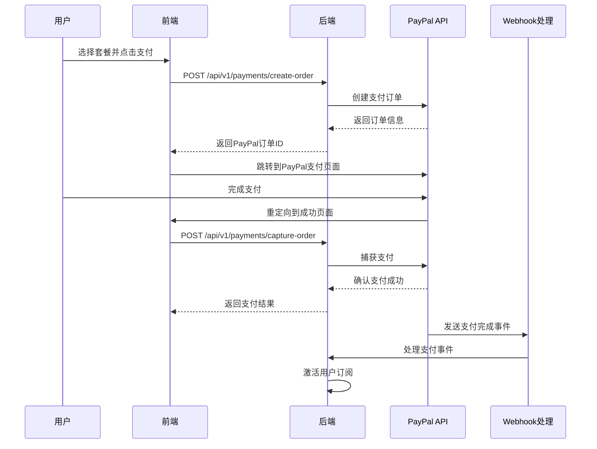

# 03PayPal支付接口开发方案

## 基于 Nano Banana AI 支付模式的 PayPal 集成方案

### 1. PayPal 集成概述

#### 1.1 支付场景分析
基于 Nano Banana AI 的定价模式，我们需要支持以下支付场景：
- **订阅支付**: 月付/年付循环订阅
- **一次性支付**: 买断版终身使用
- **升级/降级**: 套餐变更
- **退款处理**: 订阅取消退款

#### 1.2 PayPal 产品选择
```javascript
// 推荐使用的 PayPal 产品组合
- PayPal Checkout (一次性支付)
- PayPal Subscriptions (循环订阅)
- PayPal REST API (后端集成)
- PayPal Webhooks (状态同步)
```

### 2. 前端 PayPal 集成

#### 2.1 PayPal SDK 配置
```html
<!-- 在 HTML 头部引入 PayPal SDK -->
<script src="https://www.paypal.com/sdk/js?client-id=YOUR_CLIENT_ID&vault=true&intent=subscription&currency=USD&locale=zh_CN"></script>
```

#### 2.2 一次性支付组件
```jsx
// components/payment/PayPalOneTimePayment.jsx
import React, { useEffect, useRef, useState } from 'react';
import { useTranslation } from 'react-i18next';

const PayPalOneTimePayment = ({ 
  planId, 
  amount, 
  currency = 'USD', 
  onSuccess, 
  onError, 
  onCancel 
}) => {
  const { t } = useTranslation();
  const paypalRef = useRef();
  const [loading, setLoading] = useState(false);

  useEffect(() => {
    if (window.paypal && paypalRef.current) {
      window.paypal.Buttons({
        style: {
          layout: 'vertical',
          color: 'blue',
          shape: 'rect',
          label: 'paypal',
          height: 40
        },
        
        createOrder: async (data, actions) => {
          setLoading(true);
          try {
            // 调用后端API创建订单
            const response = await fetch('/api/v1/payments/create-order', {
              method: 'POST',
              headers: {
                'Content-Type': 'application/json',
                'Authorization': `Bearer ${localStorage.getItem('access_token')}`
              },
              body: JSON.stringify({
                plan_id: planId,
                amount: amount,
                currency: currency,
                payment_type: 'one_time'
              })
            });
            
            const orderData = await response.json();
            
            if (!response.ok) {
              throw new Error(orderData.detail || 'Failed to create order');
            }
            
            return orderData.paypal_order_id;
          } catch (error) {
            console.error('Create order error:', error);
            onError(error);
            setLoading(false);
          }
        },
        
        onApprove: async (data, actions) => {
          try {
            // 调用后端API确认支付
            const response = await fetch('/api/v1/payments/capture-order', {
              method: 'POST',
              headers: {
                'Content-Type': 'application/json',
                'Authorization': `Bearer ${localStorage.getItem('access_token')}`
              },
              body: JSON.stringify({
                order_id: data.orderID,
                payer_id: data.payerID
              })
            });
            
            const result = await response.json();
            
            if (response.ok) {
              onSuccess(result);
            } else {
              throw new Error(result.detail || 'Payment capture failed');
            }
          } catch (error) {
            console.error('Capture order error:', error);
            onError(error);
          } finally {
            setLoading(false);
          }
        },
        
        onCancel: (data) => {
          setLoading(false);
          onCancel(data);
        },
        
        onError: (err) => {
          setLoading(false);
          console.error('PayPal error:', err);
          onError(err);
        }
      }).render(paypalRef.current);
    }
  }, [planId, amount, currency]);

  return (
    <div className="paypal-payment-container">
      {loading && (
        <div className="loading-overlay">
          <div className="spinner"></div>
          <p>{t('payment.processing')}</p>
        </div>
      )}
      <div ref={paypalRef} className="paypal-button-container"></div>
    </div>
  );
};

export default PayPalOneTimePayment;
```

#### 2.3 订阅支付组件
```jsx
// components/payment/PayPalSubscription.jsx
import React, { useEffect, useRef, useState } from 'react';
import { useTranslation } from 'react-i18next';

const PayPalSubscription = ({ 
  planId, 
  subscriptionType, // monthly, yearly
  onSuccess, 
  onError, 
  onCancel 
}) => {
  const { t } = useTranslation();
  const paypalRef = useRef();
  const [loading, setLoading] = useState(false);

  useEffect(() => {
    if (window.paypal && paypalRef.current) {
      window.paypal.Buttons({
        style: {
          layout: 'vertical',
          color: 'blue',
          shape: 'rect',
          label: 'subscribe',
          height: 40
        },
        
        createSubscription: async (data, actions) => {
          setLoading(true);
          try {
            // 调用后端API创建订阅计划
            const response = await fetch('/api/v1/payments/create-subscription', {
              method: 'POST',
              headers: {
                'Content-Type': 'application/json',
                'Authorization': `Bearer ${localStorage.getItem('access_token')}`
              },
              body: JSON.stringify({
                plan_id: planId,
                subscription_type: subscriptionType
              })
            });
            
            const subscriptionData = await response.json();
            
            if (!response.ok) {
              throw new Error(subscriptionData.detail || 'Failed to create subscription');
            }
            
            return subscriptionData.paypal_subscription_id;
          } catch (error) {
            console.error('Create subscription error:', error);
            onError(error);
            setLoading(false);
          }
        },
        
        onApprove: async (data, actions) => {
          try {
            // 调用后端API激活订阅
            const response = await fetch('/api/v1/payments/activate-subscription', {
              method: 'POST',
              headers: {
                'Content-Type': 'application/json',
                'Authorization': `Bearer ${localStorage.getItem('access_token')}`
              },
              body: JSON.stringify({
                subscription_id: data.subscriptionID
              })
            });
            
            const result = await response.json();
            
            if (response.ok) {
              onSuccess(result);
            } else {
              throw new Error(result.detail || 'Subscription activation failed');
            }
          } catch (error) {
            console.error('Activate subscription error:', error);
            onError(error);
          } finally {
            setLoading(false);
          }
        },
        
        onCancel: (data) => {
          setLoading(false);
          onCancel(data);
        },
        
        onError: (err) => {
          setLoading(false);
          console.error('PayPal subscription error:', err);
          onError(err);
        }
      }).render(paypalRef.current);
    }
  }, [planId, subscriptionType]);

  return (
    <div className="paypal-subscription-container">
      {loading && (
        <div className="loading-overlay">
          <div className="spinner"></div>
          <p>{t('payment.processing')}</p>
        </div>
      )}
      <div ref={paypalRef} className="paypal-button-container"></div>
    </div>
  );
};

export default PayPalSubscription;
```

### 3. 后端 PayPal 集成

#### 3.1 PayPal 配置
```python
# core/config.py
import os
from pydantic import BaseSettings

class Settings(BaseSettings):
    # PayPal 配置
    PAYPAL_MODE: str = os.getenv("PAYPAL_MODE", "sandbox")  # sandbox or live
    PAYPAL_CLIENT_ID: str = os.getenv("PAYPAL_CLIENT_ID")
    PAYPAL_CLIENT_SECRET: str = os.getenv("PAYPAL_CLIENT_SECRET")
    PAYPAL_WEBHOOK_ID: str = os.getenv("PAYPAL_WEBHOOK_ID")
    
    # 应用配置
    FRONTEND_URL: str = os.getenv("FRONTEND_URL", "http://localhost:3000")
    BACKEND_URL: str = os.getenv("BACKEND_URL", "http://localhost:8000")

settings = Settings()
```

#### 3.2 PayPal 客户端封装
```python
# services/paypal_client.py
import requests
import json
from typing import Dict, Any, Optional
from app.core.config import settings

class PayPalClient:
    def __init__(self):
        self.base_url = "https://api.sandbox.paypal.com" if settings.PAYPAL_MODE == "sandbox" else "https://api.paypal.com"
        self.client_id = settings.PAYPAL_CLIENT_ID
        self.client_secret = settings.PAYPAL_CLIENT_SECRET
        self.access_token = None
    
    def get_access_token(self) -> str:
        """获取访问令牌"""
        if self.access_token:
            return self.access_token
            
        url = f"{self.base_url}/v1/oauth2/token"
        headers = {
            "Accept": "application/json",
            "Accept-Language": "en_US",
        }
        data = "grant_type=client_credentials"
        
        response = requests.post(
            url, 
            headers=headers, 
            data=data, 
            auth=(self.client_id, self.client_secret)
        )
        
        if response.status_code == 200:
            token_data = response.json()
            self.access_token = token_data["access_token"]
            return self.access_token
        else:
            raise Exception(f"Failed to get PayPal access token: {response.text}")
    
    def create_order(self, amount: float, currency: str = "USD", 
                    return_url: str = None, cancel_url: str = None) -> Dict[str, Any]:
        """创建支付订单"""
        url = f"{self.base_url}/v2/checkout/orders"
        headers = {
            "Content-Type": "application/json",
            "Authorization": f"Bearer {self.get_access_token()}",
        }
        
        order_data = {
            "intent": "CAPTURE",
            "purchase_units": [{
                "amount": {
                    "currency_code": currency,
                    "value": str(amount)
                }
            }],
            "application_context": {
                "return_url": return_url or f"{settings.FRONTEND_URL}/payment/success",
                "cancel_url": cancel_url or f"{settings.FRONTEND_URL}/payment/cancel",
                "brand_name": "Your App Name",
                "landing_page": "BILLING",
                "user_action": "PAY_NOW"
            }
        }
        
        response = requests.post(url, headers=headers, json=order_data)
        
        if response.status_code == 201:
            return response.json()
        else:
            raise Exception(f"Failed to create PayPal order: {response.text}")
    
    def capture_order(self, order_id: str) -> Dict[str, Any]:
        """捕获支付订单"""
        url = f"{self.base_url}/v2/checkout/orders/{order_id}/capture"
        headers = {
            "Content-Type": "application/json",
            "Authorization": f"Bearer {self.get_access_token()}",
        }
        
        response = requests.post(url, headers=headers)
        
        if response.status_code == 201:
            return response.json()
        else:
            raise Exception(f"Failed to capture PayPal order: {response.text}")
    
    def create_subscription_plan(self, plan_name: str, amount: float, 
                               interval: str = "MONTH") -> Dict[str, Any]:
        """创建订阅计划"""
        url = f"{self.base_url}/v1/billing/plans"
        headers = {
            "Content-Type": "application/json",
            "Authorization": f"Bearer {self.get_access_token()}",
            "PayPal-Request-Id": f"plan-{plan_name}-{interval}",
        }
        
        plan_data = {
            "product_id": "your-product-id",  # 需要先创建产品
            "name": plan_name,
            "description": f"{plan_name} subscription plan",
            "status": "ACTIVE",
            "billing_cycles": [{
                "frequency": {
                    "interval_unit": interval,
                    "interval_count": 1
                },
                "tenure_type": "REGULAR",
                "sequence": 1,
                "total_cycles": 0,  # 0 表示无限循环
                "pricing_scheme": {
                    "fixed_price": {
                        "value": str(amount),
                        "currency_code": "USD"
                    }
                }
            }],
            "payment_preferences": {
                "auto_bill_outstanding": True,
                "setup_fee": {
                    "value": "0",
                    "currency_code": "USD"
                },
                "setup_fee_failure_action": "CONTINUE",
                "payment_failure_threshold": 3
            }
        }
        
        response = requests.post(url, headers=headers, json=plan_data)
        
        if response.status_code == 201:
            return response.json()
        else:
            raise Exception(f"Failed to create PayPal subscription plan: {response.text}")
    
    def create_subscription(self, plan_id: str, subscriber_info: Dict[str, Any]) -> Dict[str, Any]:
        """创建订阅"""
        url = f"{self.base_url}/v1/billing/subscriptions"
        headers = {
            "Content-Type": "application/json",
            "Authorization": f"Bearer {self.get_access_token()}",
        }
        
        subscription_data = {
            "plan_id": plan_id,
            "subscriber": subscriber_info,
            "application_context": {
                "brand_name": "Your App Name",
                "locale": "en-US",
                "shipping_preference": "NO_SHIPPING",
                "user_action": "SUBSCRIBE_NOW",
                "payment_method": {
                    "payer_selected": "PAYPAL",
                    "payee_preferred": "IMMEDIATE_PAYMENT_REQUIRED"
                },
                "return_url": f"{settings.FRONTEND_URL}/subscription/success",
                "cancel_url": f"{settings.FRONTEND_URL}/subscription/cancel"
            }
        }
        
        response = requests.post(url, headers=headers, json=subscription_data)
        
        if response.status_code == 201:
            return response.json()
        else:
            raise Exception(f"Failed to create PayPal subscription: {response.text}")
    
    def get_subscription(self, subscription_id: str) -> Dict[str, Any]:
        """获取订阅详情"""
        url = f"{self.base_url}/v1/billing/subscriptions/{subscription_id}"
        headers = {
            "Content-Type": "application/json",
            "Authorization": f"Bearer {self.get_access_token()}",
        }
        
        response = requests.get(url, headers=headers)
        
        if response.status_code == 200:
            return response.json()
        else:
            raise Exception(f"Failed to get PayPal subscription: {response.text}")
    
    def cancel_subscription(self, subscription_id: str, reason: str = "User requested cancellation") -> bool:
        """取消订阅"""
        url = f"{self.base_url}/v1/billing/subscriptions/{subscription_id}/cancel"
        headers = {
            "Content-Type": "application/json",
            "Authorization": f"Bearer {self.get_access_token()}",
        }
        
        cancel_data = {
            "reason": reason
        }
        
        response = requests.post(url, headers=headers, json=cancel_data)
        
        return response.status_code == 204
```

#### 3.3 支付服务增强
```python
# services/payment_service.py (增强版)
from typing import Dict, Any, Optional
from sqlalchemy.orm import Session
from app.services.paypal_client import PayPalClient
from app.models.payment import PaymentOrder
from app.models.subscription import UserSubscription, SubscriptionPlan
from app.core.config import settings

class PaymentService:
    def __init__(self, db: Session):
        self.db = db
        self.paypal_client = PayPalClient()
    
    def create_one_time_payment(self, user_id: int, plan_id: int, amount: float) -> Dict[str, Any]:
        """创建一次性支付"""
        # 创建本地订单记录
        order = PaymentOrder(
            user_id=user_id,
            plan_id=plan_id,
            amount=amount,
            currency="USD",
            payment_method="paypal",
            payment_status="pending",
            payment_type="one_time"
        )
        self.db.add(order)
        self.db.commit()
        
        try:
            # 创建 PayPal 订单
            paypal_order = self.paypal_client.create_order(
                amount=amount,
                currency="USD",
                return_url=f"{settings.FRONTEND_URL}/payment/success?order_id={order.id}",
                cancel_url=f"{settings.FRONTEND_URL}/payment/cancel?order_id={order.id}"
            )
            
            # 更新订单信息
            order.external_order_id = paypal_order["id"]
            order.payment_data = paypal_order
            self.db.commit()
            
            # 获取支付链接
            approval_url = None
            for link in paypal_order.get("links", []):
                if link["rel"] == "approve":
                    approval_url = link["href"]
                    break
            
            return {
                "order_id": order.id,
                "paypal_order_id": paypal_order["id"],
                "approval_url": approval_url,
                "status": "created"
            }
            
        except Exception as e:
            order.payment_status = "failed"
            order.error_message = str(e)
            self.db.commit()
            raise e
    
    def capture_payment(self, order_id: str) -> Dict[str, Any]:
        """捕获支付"""
        try:
            # 捕获 PayPal 支付
            capture_result = self.paypal_client.capture_order(order_id)
            
            # 更新本地订单状态
            order = self.db.query(PaymentOrder).filter(
                PaymentOrder.external_order_id == order_id
            ).first()
            
            if order:
                if capture_result["status"] == "COMPLETED":
                    order.payment_status = "completed"
                    order.paid_at = datetime.utcnow()
                    order.payment_data = capture_result
                    
                    # 激活订阅
                    self.activate_subscription_from_payment(order)
                else:
                    order.payment_status = "failed"
                    order.error_message = "Payment not completed"
                
                self.db.commit()
            
            return {
                "status": "success" if capture_result["status"] == "COMPLETED" else "failed",
                "order_id": order.id if order else None,
                "paypal_data": capture_result
            }
            
        except Exception as e:
            if order:
                order.payment_status = "failed"
                order.error_message = str(e)
                self.db.commit()
            raise e
    
    def create_subscription_payment(self, user_id: int, plan_id: int, 
                                  subscription_type: str) -> Dict[str, Any]:
        """创建订阅支付"""
        plan = self.db.query(SubscriptionPlan).filter(SubscriptionPlan.id == plan_id).first()
        if not plan:
            raise ValueError("Invalid plan")
        
        # 创建本地订阅记录
        subscription = UserSubscription(
            user_id=user_id,
            plan_id=plan_id,
            subscription_type=subscription_type,
            status="pending"
        )
        self.db.add(subscription)
        self.db.commit()
        
        try:
            # 确定订阅间隔
            interval = "MONTH" if subscription_type == "monthly" else "YEAR"
            amount = plan.price_monthly if subscription_type == "monthly" else plan.price_yearly
            
            # 创建 PayPal 订阅计划（如果不存在）
            paypal_plan_id = self.get_or_create_paypal_plan(plan, interval, amount)
            
            # 创建订阅者信息
            subscriber_info = {
                "name": {
                    "given_name": "User",  # 可以从用户信息获取
                    "surname": "Name"
                },
                "email_address": "user@example.com"  # 从用户信息获取
            }
            
            # 创建 PayPal 订阅
            paypal_subscription = self.paypal_client.create_subscription(
                plan_id=paypal_plan_id,
                subscriber_info=subscriber_info
            )
            
            # 更新订阅信息
            subscription.external_subscription_id = paypal_subscription["id"]
            subscription.subscription_data = paypal_subscription
            self.db.commit()
            
            # 获取批准链接
            approval_url = None
            for link in paypal_subscription.get("links", []):
                if link["rel"] == "approve":
                    approval_url = link["href"]
                    break
            
            return {
                "subscription_id": subscription.id,
                "paypal_subscription_id": paypal_subscription["id"],
                "approval_url": approval_url,
                "status": "created"
            }
            
        except Exception as e:
            subscription.status = "failed"
            subscription.error_message = str(e)
            self.db.commit()
            raise e
    
    def activate_subscription(self, subscription_id: str) -> Dict[str, Any]:
        """激活订阅"""
        try:
            # 获取 PayPal 订阅状态
            paypal_subscription = self.paypal_client.get_subscription(subscription_id)
            
            # 更新本地订阅状态
            subscription = self.db.query(UserSubscription).filter(
                UserSubscription.external_subscription_id == subscription_id
            ).first()
            
            if subscription:
                if paypal_subscription["status"] == "ACTIVE":
                    subscription.status = "active"
                    subscription.start_date = datetime.utcnow()
                    
                    # 设置结束日期
                    if subscription.subscription_type == "monthly":
                        subscription.end_date = subscription.start_date + timedelta(days=30)
                    elif subscription.subscription_type == "yearly":
                        subscription.end_date = subscription.start_date + timedelta(days=365)
                    
                    # 更新用户积分
                    from app.services.subscription_service import SubscriptionService
                    subscription_service = SubscriptionService(self.db)
                    subscription_service.update_user_credits(
                        subscription.user_id, 
                        subscription.plan.credits_monthly
                    )
                else:
                    subscription.status = "failed"
                    subscription.error_message = f"PayPal subscription status: {paypal_subscription['status']}"
                
                self.db.commit()
            
            return {
                "status": "success" if paypal_subscription["status"] == "ACTIVE" else "failed",
                "subscription_id": subscription.id if subscription else None,
                "paypal_data": paypal_subscription
            }
            
        except Exception as e:
            if subscription:
                subscription.status = "failed"
                subscription.error_message = str(e)
                self.db.commit()
            raise e
    
    def cancel_subscription(self, user_id: int, subscription_id: int, reason: str = None) -> bool:
        """取消订阅"""
        subscription = self.db.query(UserSubscription).filter(
            UserSubscription.id == subscription_id,
            UserSubscription.user_id == user_id
        ).first()
        
        if not subscription:
            raise ValueError("Subscription not found")
        
        try:
            # 取消 PayPal 订阅
            if subscription.external_subscription_id:
                success = self.paypal_client.cancel_subscription(
                    subscription.external_subscription_id,
                    reason or "User requested cancellation"
                )
                
                if success:
                    subscription.status = "cancelled"
                    subscription.cancelled_at = datetime.utcnow()
                    subscription.auto_renew = False
                    self.db.commit()
                    return True
            
            return False
            
        except Exception as e:
            raise e
    
    def get_or_create_paypal_plan(self, plan: SubscriptionPlan, interval: str, amount: float) -> str:
        """获取或创建 PayPal 订阅计划"""
        # 这里可以缓存计划ID，避免重复创建
        plan_key = f"{plan.plan_code}_{interval}"
        
        # 从缓存或数据库获取已存在的计划ID
        # 如果不存在，创建新计划
        try:
            paypal_plan = self.paypal_client.create_subscription_plan(
                plan_name=f"{plan.plan_name} ({interval})",
                amount=amount,
                interval=interval
            )
            return paypal_plan["id"]
        except Exception as e:
            raise e
```

### 4. Webhook 处理

#### 4.1 Webhook 端点
```python
# api/v1/webhooks.py
from fastapi import APIRouter, Request, HTTPException, Depends
from sqlalchemy.orm import Session
from app.core.dependencies import get_db
from app.services.webhook_service import WebhookService
import json

router = APIRouter(prefix="/webhooks", tags=["webhooks"])

@router.post("/paypal")
async def paypal_webhook(request: Request, db: Session = Depends(get_db)):
    """处理 PayPal Webhook"""
    try:
        # 获取请求体
        body = await request.body()
        headers = dict(request.headers)
        
        # 验证 Webhook
        webhook_service = WebhookService(db)
        if not webhook_service.verify_paypal_webhook(body, headers):
            raise HTTPException(status_code=400, detail="Invalid webhook signature")
        
        # 解析事件数据
        event_data = json.loads(body)
        
        # 处理事件
        result = webhook_service.handle_paypal_event(event_data)
        
        return {"status": "success", "processed": result}
        
    except Exception as e:
        raise HTTPException(status_code=500, detail=str(e))
```

#### 4.2 Webhook 服务
```python
# services/webhook_service.py
import json
import hmac
import hashlib
from typing import Dict, Any
from sqlalchemy.orm import Session
from app.models.payment import PaymentOrder
from app.models.subscription import UserSubscription
from app.core.config import settings

class WebhookService:
    def __init__(self, db: Session):
        self.db = db
    
    def verify_paypal_webhook(self, body: bytes, headers: Dict[str, str]) -> bool:
        """验证 PayPal Webhook 签名"""
        try:
            # PayPal 使用的验证方法
            # 这里需要根据 PayPal 的具体验证要求实现
            webhook_id = settings.PAYPAL_WEBHOOK_ID
            # 实现签名验证逻辑
            return True  # 简化处理
        except Exception:
            return False
    
    def handle_paypal_event(self, event_data: Dict[str, Any]) -> bool:
        """处理 PayPal 事件"""
        event_type = event_data.get("event_type")
        
        if event_type == "PAYMENT.CAPTURE.COMPLETED":
            return self.handle_payment_completed(event_data)
        elif event_type == "BILLING.SUBSCRIPTION.ACTIVATED":
            return self.handle_subscription_activated(event_data)
        elif event_type == "BILLING.SUBSCRIPTION.CANCELLED":
            return self.handle_subscription_cancelled(event_data)
        elif event_type == "BILLING.SUBSCRIPTION.PAYMENT.FAILED":
            return self.handle_subscription_payment_failed(event_data)
        else:
            print(f"Unhandled event type: {event_type}")
            return True
    
    def handle_payment_completed(self, event_data: Dict[str, Any]) -> bool:
        """处理支付完成事件"""
        try:
            resource = event_data.get("resource", {})
            order_id = resource.get("supplementary_data", {}).get("related_ids", {}).get("order_id")
            
            if order_id:
                order = self.db.query(PaymentOrder).filter(
                    PaymentOrder.external_order_id == order_id
                ).first()
                
                if order and order.payment_status == "pending":
                    order.payment_status = "completed"
                    order.paid_at = datetime.utcnow()
                    order.payment_data = event_data
                    self.db.commit()
                    
                    # 激活订阅
                    self.activate_subscription_from_payment(order)
            
            return True
        except Exception as e:
            print(f"Error handling payment completed: {e}")
            return False
    
    def handle_subscription_activated(self, event_data: Dict[str, Any]) -> bool:
        """处理订阅激活事件"""
        try:
            resource = event_data.get("resource", {})
            subscription_id = resource.get("id")
            
            if subscription_id:
                subscription = self.db.query(UserSubscription).filter(
                    UserSubscription.external_subscription_id == subscription_id
                ).first()
                
                if subscription:
                    subscription.status = "active"
                    subscription.start_date = datetime.utcnow()
                    self.db.commit()
            
            return True
        except Exception as e:
            print(f"Error handling subscription activated: {e}")
            return False
    
    def handle_subscription_cancelled(self, event_data: Dict[str, Any]) -> bool:
        """处理订阅取消事件"""
        try:
            resource = event_data.get("resource", {})
            subscription_id = resource.get("id")
            
            if subscription_id:
                subscription = self.db.query(UserSubscription).filter(
                    UserSubscription.external_subscription_id == subscription_id
                ).first()
                
                if subscription:
                    subscription.status = "cancelled"
                    subscription.cancelled_at = datetime.utcnow()
                    subscription.auto_renew = False
                    self.db.commit()
            
            return True
        except Exception as e:
            print(f"Error handling subscription cancelled: {e}")
            return False
```

### 5. 支付流程图



### 6. 错误处理和重试机制

#### 6.1 支付失败处理
```python
# services/payment_retry_service.py
from celery import Celery
from app.services.payment_service import PaymentService

celery_app = Celery('payment_tasks')

@celery_app.task(bind=True, max_retries=3)
def retry_failed_payment(self, order_id: int):
    """重试失败的支付"""
    try:
        # 重试支付逻辑
        pass
    except Exception as exc:
        # 指数退避重试
        raise self.retry(exc=exc, countdown=60 * (2 ** self.request.retries))
```

#### 6.2 订阅状态同步
```python
# tasks/subscription_sync.py
from celery import Celery
from app.services.subscription_service import SubscriptionService

@celery_app.task
def sync_subscription_status():
    """定期同步订阅状态"""
    # 获取所有活跃订阅
    # 调用PayPal API检查状态
    # 更新本地数据库
    pass
```

### 7. 测试方案

#### 7.1 单元测试
```python
# tests/test_payment_service.py
import pytest
from app.services.payment_service import PaymentService

class TestPaymentService:
    def test_create_one_time_payment(self):
        # 测试一次性支付创建
        pass
    
    def test_create_subscription_payment(self):
        # 测试订阅支付创建
        pass
    
    def test_capture_payment(self):
        # 测试支付捕获
        pass
```

#### 7.2 集成测试
```python
# tests/test_paypal_integration.py
import pytest
from app.services.paypal_client import PayPalClient

class TestPayPalIntegration:
    def test_paypal_order_flow(self):
        # 测试完整的PayPal支付流程
        pass
    
    def test_paypal_subscription_flow(self):
        # 测试完整的PayPal订阅流程
        pass
```

### 8. 部署配置

#### 8.1 环境变量
```bash
# .env
PAYPAL_MODE=sandbox
PAYPAL_CLIENT_ID=your_client_id
PAYPAL_CLIENT_SECRET=your_client_secret
PAYPAL_WEBHOOK_ID=your_webhook_id
```

#### 8.2 Nginx 配置
```nginx
# PayPal Webhook 配置
location /api/v1/webhooks/paypal {
    proxy_pass http://backend:8000;
    proxy_set_header Host $host;
    proxy_set_header X-Real-IP $remote_addr;
    proxy_set_header X-Forwarded-For $proxy_add_x_forwarded_for;
    proxy_set_header X-Forwarded-Proto $scheme;
}
```

这个 PayPal 支付接口开发方案提供了完整的前后端集成方案，包括一次性支付、订阅支付、Webhook处理、错误处理和测试方案，可以满足类似 Nano Banana AI 的支付需求。
