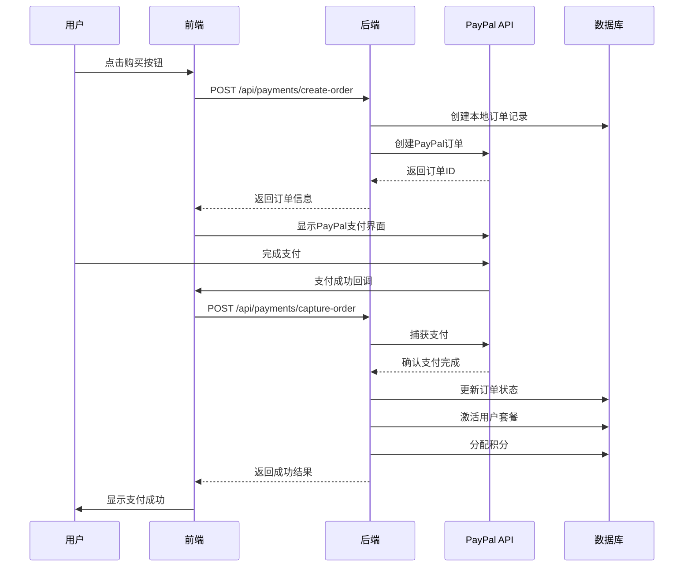
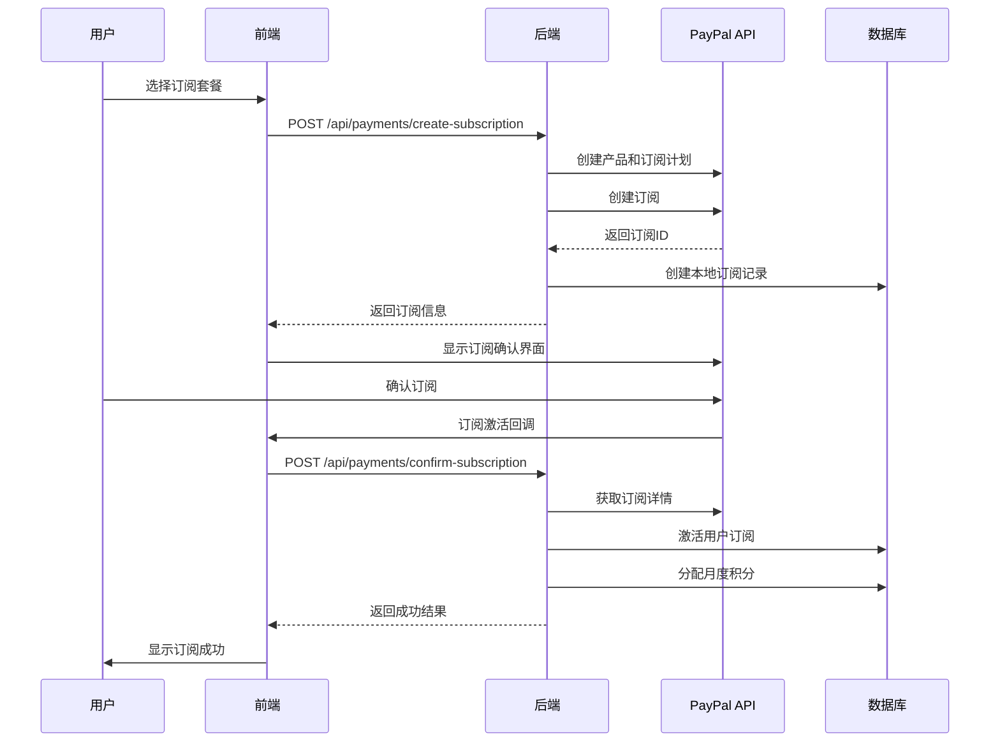

# PayPal支付集成技术文档

## 项目概述

本文档详细说明了Nano Banana AI项目中PayPal支付功能的集成实现，包括前端组件、后端API、配置参数和部署指南。

## 1. 配置参数

### 1.1 PayPal商户信息
- **商户名称**: comfort global vacationbusiness inc
- **环境**: 生产环境 (Live)

### 1.2 环境变量配置

#### 前端配置 (.env)
```bash
# PayPal 支付配置
VITE_PAYPAL_CLIENT_ID=Aak5qlK7voEE39rYTuKQbe5c6obYHFhG6nuHeF_8Gdf4WHKzsNZeWli2RsYiQSHCcqlWA7fyjGmmDTac
```

#### 后端配置 (server/.env)
```bash
# PayPal 支付配置
PAYPAL_CLIENT_ID=Aak5qlK7voEE39rYTuKQbe5c6obYHFhG6nuHeF_8Gdf4WHKzsNZeWli2RsYiQSHCcqlWA7fyjGmmDTac
PAYPAL_CLIENT_SECRET=EPZ-LVrf-bq_ehn4MrjB4kVd4LACWA-b2K9CK7_VCv17MhfkC9WNdgeLBZcwImtrkPU0A_yrMX1zkfnb
PAYPAL_API_URL=https://api-m.paypal.com
PAYPAL_WEBHOOK_ID=1MB06404GW769264Y
PAYPAL_ENVIRONMENT=live
```

## 2. 技术架构

### 2.1 前端组件

#### PayPalButton组件 (`components/PayPalButton.tsx`)
- 支持一次性支付和订阅支付
- 集成PayPal JavaScript SDK
- 处理支付成功、失败和取消回调
- 支持多种货币和自定义样式

**主要功能**:
- 动态加载PayPal SDK
- 创建PayPal订单/订阅
- 处理支付确认
- 错误处理和用户反馈

#### PricingPage组件 (`components/PricingPage.tsx`)
- 显示套餐价格和功能对比
- 集成PayPal支付按钮
- 支持月付/年付切换
- 用户认证检查

### 2.2 后端API

#### 支付路由 (`server/routes/payments.mjs`)
提供以下API端点：

1. **POST /api/payments/create-order**
   - 创建一次性支付订单
   - 生成PayPal订单ID
   - 记录本地订单信息

2. **POST /api/payments/capture-order**
   - 捕获PayPal支付
   - 更新订单状态
   - 激活用户套餐和积分

3. **POST /api/payments/create-subscription**
   - 创建PayPal订阅计划
   - 生成订阅ID
   - 记录订阅信息

4. **POST /api/payments/confirm-subscription**
   - 确认订阅激活
   - 更新用户套餐状态
   - 分配月度积分

5. **POST /api/payments/webhook**
   - 处理PayPal Webhook事件
   - 同步支付状态
   - 自动化订阅管理

## 3. 支付流程

### 3.1 一次性支付流程（买断版）



### 3.2 订阅支付流程（月付/年付）



## 4. 数据库设计

### 4.1 支付相关表结构

#### pay_payment_orders (支付订单表)
```sql
CREATE TABLE pay_payment_orders (
    id UUID PRIMARY KEY DEFAULT gen_random_uuid(),
    user_id UUID REFERENCES users(id) ON DELETE CASCADE,
    plan_id UUID REFERENCES pay_subscription_plans(id),
    amount DECIMAL(10,2) NOT NULL,
    currency VARCHAR(3) DEFAULT 'USD',
    payment_method VARCHAR(50) NOT NULL,
    payment_status VARCHAR(20) DEFAULT 'pending',
    payment_type VARCHAR(20) NOT NULL, -- 'one_time' or 'subscription'
    external_order_id VARCHAR(255), -- PayPal订单ID
    order_data JSONB,
    payment_data JSONB,
    completed_at TIMESTAMP WITH TIME ZONE,
    created_at TIMESTAMP WITH TIME ZONE DEFAULT NOW(),
    updated_at TIMESTAMP WITH TIME ZONE DEFAULT NOW()
);
```

#### pay_user_subscriptions (用户订阅表)
```sql
CREATE TABLE pay_user_subscriptions (
    id UUID PRIMARY KEY DEFAULT gen_random_uuid(),
    user_id UUID REFERENCES users(id) ON DELETE CASCADE,
    plan_id UUID REFERENCES pay_subscription_plans(id),
    external_subscription_id VARCHAR(255), -- PayPal订阅ID
    status VARCHAR(20) DEFAULT 'pending',
    started_at TIMESTAMP WITH TIME ZONE,
    expires_at TIMESTAMP WITH TIME ZONE,
    cancelled_at TIMESTAMP WITH TIME ZONE,
    subscription_data JSONB,
    webhook_data JSONB,
    created_at TIMESTAMP WITH TIME ZONE DEFAULT NOW(),
    updated_at TIMESTAMP WITH TIME ZONE DEFAULT NOW()
);
```

#### pay_credit_transactions (积分交易表)
```sql
CREATE TABLE pay_credit_transactions (
    id UUID PRIMARY KEY DEFAULT gen_random_uuid(),
    user_id UUID REFERENCES users(id) ON DELETE CASCADE,
    transaction_type VARCHAR(20) NOT NULL, -- 'purchase', 'subscription', 'usage', 'refund'
    credits INTEGER NOT NULL,
    description TEXT,
    order_id UUID REFERENCES pay_payment_orders(id),
    subscription_id VARCHAR(255),
    created_at TIMESTAMP WITH TIME ZONE DEFAULT NOW()
);
```

## 5. 安全配置

### 5.1 RLS (Row Level Security) 策略

```sql
-- 启用RLS
ALTER TABLE pay_payment_orders ENABLE ROW LEVEL SECURITY;
ALTER TABLE pay_user_subscriptions ENABLE ROW LEVEL SECURITY;
ALTER TABLE pay_credit_transactions ENABLE ROW LEVEL SECURITY;

-- 用户只能访问自己的支付记录
CREATE POLICY "payment_orders_user_policy" ON pay_payment_orders
    FOR ALL TO authenticated
    USING (auth.uid() = user_id);

CREATE POLICY "user_subscriptions_user_policy" ON pay_user_subscriptions
    FOR ALL TO authenticated
    USING (auth.uid() = user_id);

CREATE POLICY "credit_transactions_user_policy" ON pay_credit_transactions
    FOR ALL TO authenticated
    USING (auth.uid() = user_id);
```

### 5.2 API认证

后端API使用Supabase JWT令牌进行用户认证：

```javascript
const authenticateUser = async (req, res, next) => {
  const authHeader = req.headers.authorization;
  if (!authHeader || !authHeader.startsWith('Bearer ')) {
    return res.status(401).json({ error: '缺少认证令牌' });
  }

  const token = authHeader.substring(7);
  const { data: { user }, error } = await supabase.auth.getUser(token);
  
  if (error || !user) {
    return res.status(401).json({ error: '无效的认证令牌' });
  }

  req.user = user;
  next();
};
```

## 6. Webhook配置

### 6.1 PayPal Webhook设置

在PayPal开发者控制台配置Webhook：

- **Webhook URL**: `https://nanobanana.gitagent.io/api/payments/webhook`
- **Webhook ID**: `1MB06404GW769264Y`

### 6.2 监听事件

- `BILLING.SUBSCRIPTION.ACTIVATED` - 订阅激活
- `BILLING.SUBSCRIPTION.CANCELLED` - 订阅取消
- `PAYMENT.SALE.COMPLETED` - 支付完成
- `BILLING.SUBSCRIPTION.PAYMENT.FAILED` - 订阅支付失败

## 7. 错误处理

### 7.1 常见错误类型

1. **认证错误**
   - 无效的PayPal凭据
   - 过期的访问令牌
   - 用户认证失败

2. **支付错误**
   - 支付金额不匹配
   - 货币类型不支持
   - 支付被拒绝

3. **订阅错误**
   - 订阅计划不存在
   - 重复订阅
   - 订阅状态异常

### 7.2 错误处理策略

```javascript
try {
  // 支付处理逻辑
} catch (error) {
  console.error('支付处理失败:', error);
  
  // 记录错误日志
  await supabase
    .from('payment_logs')
    .insert({
      user_id,
      error_type: error.name,
      error_message: error.message,
      request_data: req.body
    });
  
  // 返回用户友好的错误信息
  res.status(500).json({ 
    error: '支付处理失败，请稍后重试',
    code: error.code 
  });
}
```

## 8. 测试指南

### 8.1 本地测试

1. **配置测试环境变量**
```bash
PAYPAL_ENVIRONMENT=sandbox
PAYPAL_API_URL=https://api-m.sandbox.paypal.com
```

2. **使用PayPal测试账户**
   - 买家账户: sb-buyer@business.example.com
   - 卖家账户: sb-seller@business.example.com

### 8.2 生产环境测试

1. **小额测试支付**
   - 使用最低金额进行真实支付测试
   - 验证订单创建和捕获流程

2. **Webhook测试**
   - 使用PayPal Webhook模拟器
   - 验证事件处理逻辑

## 9. 部署指南

### 9.1 环境变量部署

```bash
# 复制配置到服务器
scp -i /path/to/key .env ec2-user@server:/path/to/project/
scp -i /path/to/key server/.env ec2-user@server:/path/to/project/server/

# 重启服务
ssh -i /path/to/key ec2-user@server "cd /path/to/project && npm restart"
```

### 9.2 Nginx配置

```nginx
# 支付API代理
location /api/payments/ {
    proxy_pass http://localhost:3002/api/payments/;
    proxy_set_header Host $host;
    proxy_set_header X-Real-IP $remote_addr;
    proxy_set_header X-Forwarded-For $proxy_add_x_forwarded_for;
    proxy_set_header X-Forwarded-Proto $scheme;
}
```

## 10. 监控和日志

### 10.1 支付日志记录

```javascript
// 记录支付事件
const logPaymentEvent = async (eventType, data) => {
  await supabase
    .from('payment_logs')
    .insert({
      event_type: eventType,
      event_data: data,
      timestamp: new Date().toISOString()
    });
};
```

### 10.2 监控指标

- 支付成功率
- 平均支付处理时间
- 错误率和错误类型分布
- 订阅续费率

## 11. 故障排除

### 11.1 常见问题

1. **PayPal SDK加载失败**
   - 检查网络连接
   - 验证Client ID配置
   - 检查CORS设置

2. **支付创建失败**
   - 验证API凭据
   - 检查金额格式
   - 确认货币类型支持

3. **Webhook未触发**
   - 验证Webhook URL可访问性
   - 检查SSL证书
   - 确认事件订阅配置

### 11.2 调试工具

- PayPal开发者控制台
- 浏览器开发者工具
- 服务器日志文件
- Supabase实时日志

## 12. 联系信息

- **技术支持**: support@nanobanana.gitagent.io
- **PayPal商户支持**: PayPal商户服务中心
- **文档更新**: 请联系开发团队

---

**文档版本**: v1.0  
**最后更新**: 2024年12月  
**维护者**: Nano Banana AI开发团队
